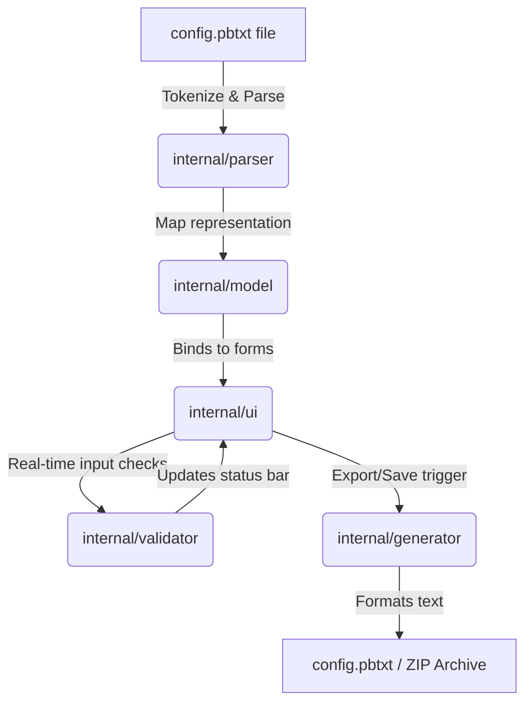
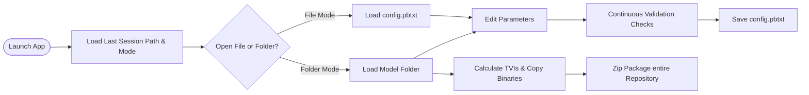

# TriGen: Comprehensive Developer Context & Architecture Manual

This document is a complete technical and conceptual specification for **TriGen**. It is designed to give other AI systems (like ChatGPT) full context on the application's purpose, technology stack, features, workflows, and code-level design workarounds.

---

## 📖 1. Core Purpose & Use Cases (Uses)
Inference engineers deploying models to **NVIDIA Triton Inference Server** must write highly specific protobuf configuration files (`config.pbtxt`) and arrange model files (e.g., ONNX, TensorRT, PyTorch) in strict directory hierarchies based on versions. Writing these configurations by hand is error-prone and time-consuming.

**TriGen** solves this by acting as a standalone editor and a repository packager:
* **Use Case A: Standalone Config Editor (File Mode)**: Directly opens, edits, validates, and saves any `.pbtxt` text configuration file.
* **Use Case B: Repository Structurer (Folder Mode)**: Manages a full model folder, calculates Triton Version Integers (TVIs), copies model binaries into version subdirectories, and packages the entire layout into a deployment-ready `.zip` archive.
* **Use Case C: Real-Time Constraint Validation**: Warns the engineer of duplicate tensor names, input/output collisions, or invalid dimensions *during editing* before deploying to production.

---

## 🛠️ 2. Technology Stack & Rationale
| Component | Choice | Rationale |
| :--- | :--- | :--- |
| **Language** | Go 1.24 | Compiled, fast startup (<2s), small memory footprint (<100MB), strong type safety, and direct filesystem access. |
| **GUI Library** | Fyne v2 | Statically compiled, offline-first GUI toolkit. Allows building native desktop apps with a consistent dark-theme layout without relying on bulky browser shells (Electron). |
| **Packaging Engine** | `fyne-cross` + Docker | Cross-compiles macOS host source code into Windows `.exe` and Ubuntu Linux binaries via pre-configured Docker toolchain containers. |

---

## 🎛️ 3. Complete Feature Catalog
* **Text Proto Parser & Generator**:
  * Tokenizes and parses `.pbtxt` text files into intermediate JSON maps, then unmarshals them into Go structs. Duplicates (e.g., repeated `input` keys) are correctly converted to slices.
  * Formats struct changes back into valid Triton protobuf text.
* **Dual-Mode UI Boundaries**:
  * **File Mode**: Restricts GUI to configuration edits. Disables versions and packaging features.
  * **Folder Mode**: Unlocks the **Versions & Models** and **Export Repository** sidebar panels.
* **Calculated Triton Version Integers (TVI)**:
  * Computes TVIs from semantic versions: $\text{TVI} = 10000 \times \text{major} + 100 \times \text{minor} + \text{patch}$.
  * Creates directory folders named after the calculated TVI and copies model files there.
* **ZIP Exporter**:
  * Compresses the repository and normalizes all internal paths to forward-slashes (`/`), preventing file corruption on Windows-to-Linux cross-platform Extractions.
* **Built-in Templates**:
  * Pre-configured profiles for PyTorch, TensorRT, ONNX, and Python LLM models.

---

## 🔄 4. System Layouts & Workflows (Flows)

### A. Data Flow (Serialization & Editing)


### B. User Layout Workflow


---

## 🎨 5. Custom UI Engineering & Workarounds (Quirks)

To build a professional, responsive interface within Fyne's default sizing bounds, the following implementations were engineered:

### A. Nil-Callback Checkbox Initialization
Fyne checkboxes execute their `OnChanged` callbacks automatically when their state is set programmatically. This caused switching tabs to mark files as unsaved (`*` dirty indicator) even if no edits occurred.
* **Workaround**: Checkboxes are initialized with a `nil` handler, their checked values are set, and then their `OnChanged` callbacks are registered.

### B. Thinned HSplit Dividers
By default, Fyne HSplit splitters use `theme.SizeNamePadding * 2` (resulting in a thick `16px` border).
* **Workaround**: We wrap the splitters in a custom theme (`splitTheme`) overriding the padding size to `3` (shrinking the border to a sleek `6px`).
* **Isolation**: The inner columns (Sidebar, Form, Preview) are wrapped back in standard `ThemeOverrides` to prevent their internal input margins and paddings from shrinking.

### C. Sidebar Compact Text Primitives
Default `widget.Label` wrappers have a large built-in min-height.
* **Workaround**: Sidebar items use raw `canvas.Text` primitives inside custom click-handlers. They are stacked using `tightVBoxLayout` which enforces a vertical spacing of exactly `1px`.

### D. Dynamic Window Auto-Sizing
To prevent layout squishing when columns are added, `e.adjustWindowSize()` dynamically resizes the window width:
* **Sidebar**: `200px` (Fixed)
* **Standard Form Workspace**: `450px` (Fixed)
* **Split Lists** (Inputs, Outputs, etc.): `200px` (Fixed)
* **Live Preview Panel**: `450px` (Fixed)
* **Execution**: Window width resizes dynamically from `650px` (min layout) up to `1300px` (max layout with 4 active columns). The split ratios (`Offsets`) are updated programmatically on resize to keep columns from stretching.

---

## 📂 6. Repository Project Sitemap

```
trigen/
├── cmd/
│   └── app/
│       └── main.go       # Main launcher, setups theme, restores session
├── internal/
│   ├── model/            # Config structs and CloneConfig() deep cloner (clone.go)
│   ├── parser/           # Scanner tokenizer and recursive descent parser
│   ├── generator/        # Triton protobuf text formatter
│   ├── validator/        # Real-time warnings constraints engine
│   ├── state/            # State machine (dirty indicator, error maps)
│   ├── fileio/           # Atomic file reads and writes
│   ├── exporter/         # TVI math, copying binaries, and ZIP packaging
│   ├── templates/        # Built-in PyTorch, TRT, ONNX, and Python LLM configs
│   └── ui/               # Main layout grid, custom themes, and sections forms
├── releases/             # Pre-compiled standalone binaries for Windows & Ubuntu
│   ├── TriGen.exe        # Raw Windows 64-bit GUI binary
│   ├── TriGen            # Raw Linux 64-bit Ubuntu-compatible executable
│   ├── TriGen.exe.zip    # Compressed Windows ZIP archive
│   └── TriGen.tar.xz     # Compressed Linux TAR archive
├── SDD.md                # Software Design Document
└── capabilities.md       # This specifications context file
```
